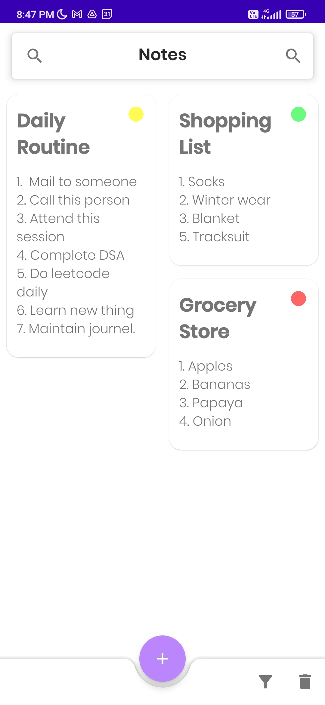
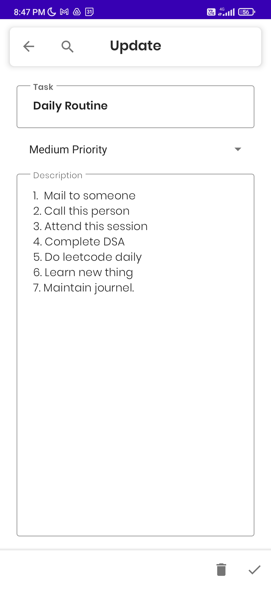
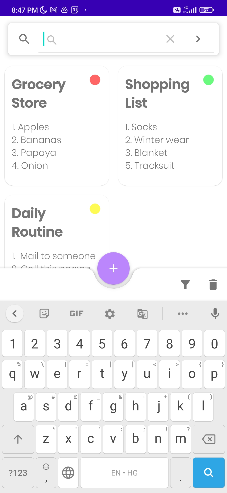
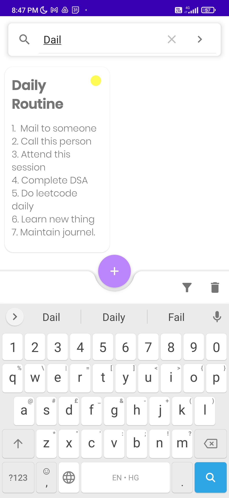
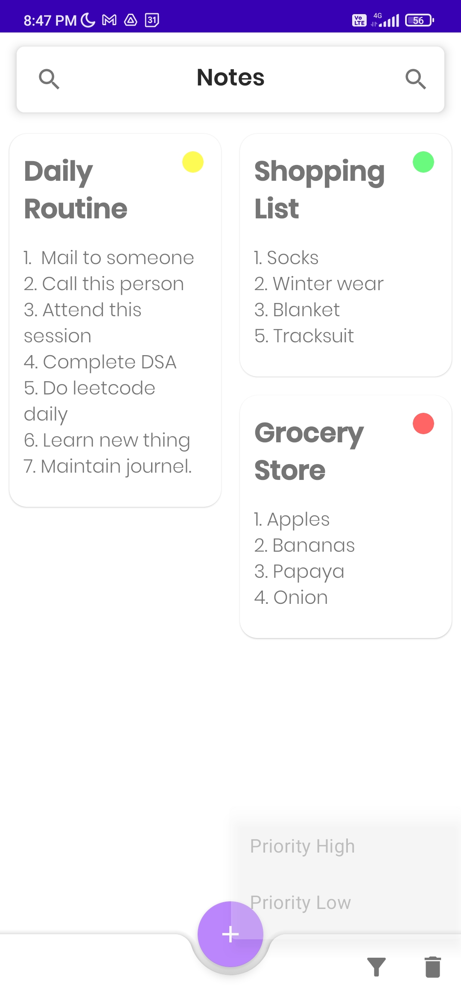

## NOTIFY
---

### Problem Statement
#### College or University App : 
An app which could help your fellow students or faculty or college. 

### Proposed Solution
*Notify* is a To Do app which help the user to make notes by adding a new task and specify its priority. 

* **Add button**: the '+' symbol button helps the user to add a new task to the app. User can add the task name, short description and the priority order of it. 

* **Search bar**: helps the user to search the particular task in the app. 

* **Filter option**: arrange the tasks on the basis of priorities. 

* **Delete option**: allow the user to delete all the tasks present in the app. For the deletion of a particular task user can find the delete option when he navigate to that particular task.

### Functionality & Concepts Used

* The app has a very simple and interactive interface filled with micro interactions and animations. 

* It helps the students to add notes and filter according to priority. 

* We have used Navigation Component which runs on the principle of using one activity and multiple fragments. 

* Recycler View : To present the list of notes. We have used a Staggered Grid Layout for the recycler view as showing as a list seems too old nowadays. Visually, staggered grid looks better for this app. 

* LiveData & Room Database : We are also using LiveData to update & observe any changes along with Room Database to store the notes that are added. 

### Application Link & Future Scope

Link to download the application. Click [here](https://bit.ly/3qZUsrR) to download the app from Google Drive.

AS a future scope, we have planned many new features to be added to the project. 

* Addition of voice notes. 
* Reminders for some tasks
* Task feature to strike off completed ones. 
* Login and Signup using Firebase
* Cloud storage of user data. 

These are some of the features that we think are necessary and we are working on it and in future we will be adding them. 

### App Screenshots

 

   &nbsp; &nbsp;
   &nbsp; &nbsp;
     
   &nbsp; &nbsp;
  &nbsp; &nbsp;
  

 

### LICENSE
Copyright 2022 Shristi Sarma

   Licensed under the Apache License, Version 2.0 (the "License");
   you may not use this file except in compliance with the License.
   You may obtain a copy of the License at

       http://www.apache.org/licenses/LICENSE-2.0

   Unless required by applicable law or agreed to in writing, software
   distributed under the License is distributed on an "AS IS" BASIS,
   WITHOUT WARRANTIES OR CONDITIONS OF ANY KIND, either express or implied.
   See the License for the specific language governing permissions and
   limitations under the License.
